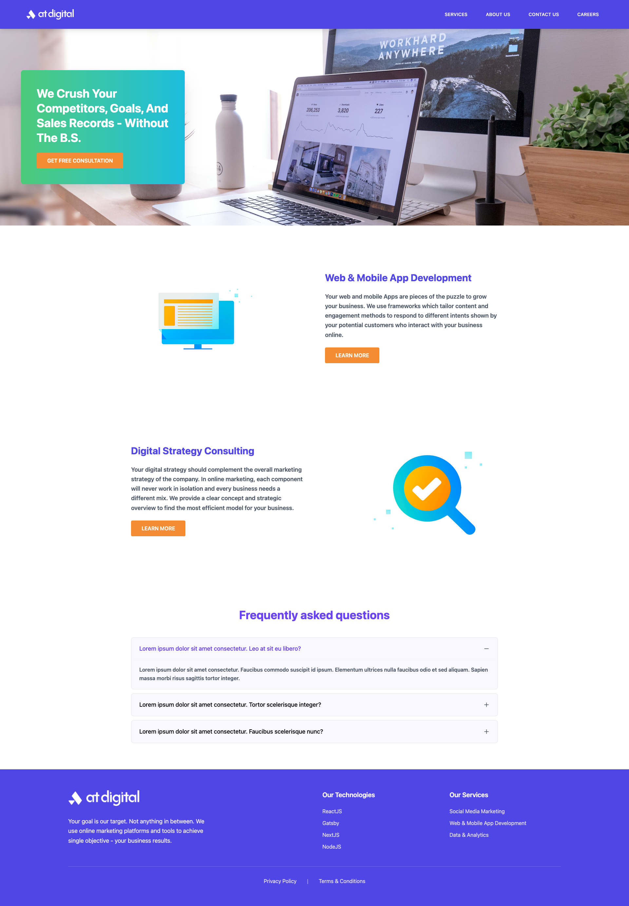

# AT Digital - Modern Digital Marketing Website

A responsive, modern website built with React, TypeScript, and Tailwind CSS showcasing AT Digital's services and expertise in digital marketing and web development.


## 📸 Screenshots

### Desktop View

*Modern hero section with gradient overlay and call-to-action*

### Mobile View

*Mobile-friendly navigation menu*

## ✨ Features

### 🎨 Design & UI
- **Modern Responsive Design** - Looks great on all devices
- **Professional Color Scheme** - Purple and orange branding
- **Smooth Animations** - CSS transitions and hover effects
- **Clean Typography** - Optimized for readability

### 🧩 Components
- **Interactive Header** - Responsive navigation with mobile menu
- **Hero Section** - Eye-catching banner with gradient overlay
- **Services Showcase** - Two-column layout with alternating images
- **FAQ Section** - Collapsible accordion with smooth animations
- **Professional Footer** - Company info, technologies, and services

### 📱 Responsive Features
- **Mobile-First Design** - Optimized for mobile devices
- **Tablet Support** - Perfect display on tablet screens
- **Desktop Layout** - Enhanced experience on larger screens
- **Custom Breakpoints** - Specific padding for 375px, 768px, and 1440px+ screens

### 🔧 Technical Features
- **TypeScript** - Type-safe development
- **React Hooks** - Modern React patterns (useState, custom hooks)
- **Component Architecture** - Modular, reusable components
- **Custom CSS Classes** - Responsive header padding
- **Optimized Images** - Proper image handling and optimization

## 🛠️ Technologies Used

### Frontend Framework
- **React 19.1.1** - Modern UI library
- **TypeScript 5.8.3** - Type-safe JavaScript
- **Vite 7.1.0** - Fast build tool and dev server

### Styling
- **Tailwind CSS 4.1.11** - Utility-first CSS framework
- **Custom CSS** - Additional styling for specific requirements
- **Lucide React** - Beautiful icons and symbols

### Development Tools
- **ESLint** - Code linting and quality
- **PostCSS** - CSS processing
- **Autoprefixer** - CSS vendor prefixes

### Package Management
- **npm** - Package manager
- **Node.js** - Runtime environment

## 📁 Project Structure

```
atdigital_task/
├── public/
│   └── index.html
├── src/
│   ├── assets/                 # Images and static files
│   │   ├── atdigitalLogo.png
│   │   ├── herobanner.jpg
│   │   ├── computerImage.png
│   │   └── searchImage.png
│   ├── components/             # React components
│   │   ├── Header/
│   │   │   └── Header.tsx
│   │   ├── Hero/
│   │   │   └── Hero.tsx
│   │   ├── Services/
│   │   │   ├── Services.tsx
│   │   │   └── ServiceIcons.tsx
│   │   ├── FAQ/
│   │   │   └── FAQ.tsx
│   │   └── Footer/
│   │       └── Footer.tsx
│   ├── data/                   # Static data
│   │   ├── servicesData.ts
│   │   └── faqData.ts
│   ├── hooks/                  # Custom React hooks
│   │   ├── useNavigation.ts
│   │   └── useFAQ.ts
│   ├── types/                  # TypeScript type definitions
│   │   └── index.ts
│   ├── App.tsx                 # Main app component
│   ├── App.css                 # Custom styles
│   ├── index.css               # Global styles and theme
│   └── main.tsx                # App entry point
├── package.json
├── vite.config.ts
├── tsconfig.json
└── tailwind.config.js
```

## 🚀 Getting Started

### Prerequisites
- Node.js (v18 or higher)
- npm or yarn package manager

### Installation

1. **Clone the repository**
   ```bash
   git clone https://github.com/chamudithaperera/ATdigital-Front-end-Development-Task.git
   cd ATdigital-Front-end-Development-Task/atdigital_task
   ```

2. **Install dependencies**
   ```bash
   npm install
   ```

3. **Start the development server**
   ```bash
   npm run dev
   ```

4. **Open your browser**
   ```
   http://localhost:5173
   ```

### Build for Production

```bash
# Build the project
npm run build

# Preview the build
npm run preview
```

### Linting

```bash
# Run ESLint
npm run lint
```

## 🎯 Key Components

### Header Component
- Responsive navigation bar
- Mobile hamburger menu
- Custom padding for different screen sizes (20px, 40px, 80px)
- Smooth transitions and hover effects

### Hero Section
- Full-width banner image
- Gradient overlay with call-to-action
- Responsive positioning and typography
- Mobile-optimized layout

### Services Section
- Alternating image-text layout
- Two main services: Web Development & Digital Strategy
- Responsive image handling
- Call-to-action buttons

### FAQ Component
- Interactive accordion functionality
- Smooth expand/collapse animations
- First item open by default
- Dynamic text color changes (black → purple when active)

### Footer
- Three-column layout (50% + 25% + 25%)
- Company information with larger logo
- Technologies and Services listings
- Privacy Policy and Terms links

## 🎨 Design System

### Color Palette
- **Primary**: `#4F46E5` (Bluish Purple)
- **Secondary**: `#F28D35` (Yuzu Jam)
- **Analogous**: `#6A44F2` (Ice Ice Baby)
- **Dark**: `#4DCA79` (Interstellar Blue)
- **Text**: `#52378C` (Tricorn Black)

### Typography
- Font family: System fonts (optimized for performance)
- Responsive font sizes
- Proper line heights for readability
- Letter spacing for navigation items

### Responsive Breakpoints
- **Mobile**: 375px (20px padding)
- **Tablet**: 768px (40px padding)  
- **Desktop**: 1440px+ (80px padding)

## 📱 Responsive Design

The website is fully responsive with specific optimizations for:

- **Mobile (375px)**: Simplified layout, stacked elements, touch-friendly buttons
- **Tablet (768px)**: Balanced layout with improved spacing
- **Desktop (1440px+)**: Full multi-column layout with enhanced typography

## 🔄 State Management

### Custom Hooks
- `useNavigation`: Manages mobile menu toggle state
- `useFAQ`: Handles FAQ accordion expand/collapse logic

### Component State
- FAQ item open/closed states
- Mobile menu visibility
- Interactive hover states

## 🚀 Performance Optimizations

- **Vite Build Tool**: Fast development and optimized production builds
- **Code Splitting**: Automatic code splitting by Vite
- **Image Optimization**: Properly sized and compressed images
- **CSS Optimization**: Tailwind CSS purging for minimal bundle size
- **TypeScript**: Better development experience and fewer runtime errors

## 🧪 Browser Support

- Chrome (latest)
- Firefox (latest)
- Safari (latest)
- Edge (latest)
- Mobile browsers (iOS Safari, Chrome Mobile)

## 📝 Development Notes

### Code Quality
- TypeScript for type safety
- ESLint for code consistency
- Component-based architecture
- Custom hooks for reusable logic

### Styling Approach
- Tailwind CSS for rapid development
- Custom CSS for specific requirements
- Mobile-first responsive design
- Consistent spacing and typography

## 🤝 Contributing

1. Fork the project
2. Create your feature branch (`git checkout -b feature/AmazingFeature`)
3. Commit your changes (`git commit -m 'Add some AmazingFeature'`)
4. Push to the branch (`git push origin feature/AmazingFeature`)
5. Open a Pull Request

## 📄 License

This project is licensed under the MIT License - see the [LICENSE](LICENSE) file for details.

## 👨‍💻 Author

**Chamuditha Kavishan**
- GitHub: [@chamudithakavishan](https://github.com/chamudithakavishan)
- LinkedIn: [Chamuditha Kavishan](https://linkedin.com/in/chamudithakavishan)

## 🙏 Acknowledgments

- AT Digital for the design requirements
- React team for the amazing framework
- Tailwind CSS for the utility-first approach
- Lucide React for beautiful icons
- Vite team for the excellent build tool

---

⭐ Star this repo if you found it helpful!